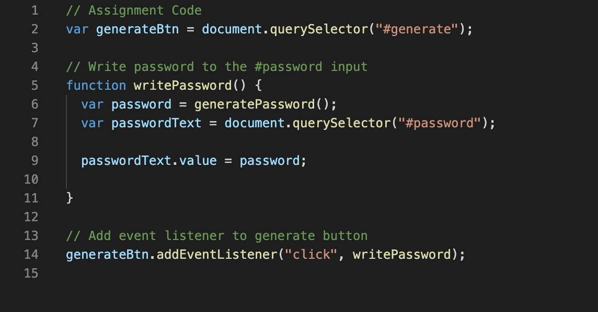

# Password Generator
## Table of contents
* [Prerequisites](https://github.com/brianjunhyuplee/portfolio#prerequisites)
* [Objective](https://github.com/brianjunhyuplee/portfolio#objective)
* [Operation](https://github.com/brianjunhyuplee/portfolio#operation)
* [Process](https://github.com/brianjunhyuplee/portfolio#process)
* [Built-With](https://github.com/brianjunhyuplee/portfolio#built-with)
* [Deployed-Link](https://github.com/brianjunhyuplee/portfolio#deployed-link)
* [Authors](https://github.com/brianjunhyuplee/portfolio#authors)
* [License](https://github.com/brianjunhyuplee/portfolio#license)
* [Acknowledgements](https://github.com/brianjunhyuplee/portfolioo#acknowledgments)
## Prerequisites:
* Computer with internet access
## Objective: 

Create a website that generates a random password with the given user criterias.


## Operation:

**To access the website, simply click on this [deploymentlink](https://brianjunhyuplee.github.io/portfolio/).**

1. Start by clicking on the "Generate Password" Button.
2. The interface will prompt the user if a specified length is required.
    1. *If one is not required, click cancel.*
    2. *If one is required, click ok.*
        1. *The user will then be prompted to enter a length between 8 and 128*
        2. *Enter a number between the range*
3. The interface will prompt the user if any specified characters are required.
    1. *If one is not required, click cancel.*
    2. *If one (or more) is required, click ok.*
        1. *The user will then be prompted to enter what characters should be required.*
        2. *Enter the corresponding letters*
4. The interface will do the rest of the work and output results in the text box.


## Process:
**1.  Download given template**

The given template contained three files.
1. *index.html*
2. *style.css*
3. *scripts.js*

After interpreting the HTML and JS files, a basic plan can be made.
*Nothing was added to the HTML and CSS files.*

**2.  Design Each Webpage**

This is the image of the basic template for the JS file


Based on the above image:
1. Create a function called generatePassword

A variable called password was defined as by function called generatePassword();.
By the name of the function, we can infer that most of the calculations and other functions will be performed here.
*Create the function by using the code below*
``bash
function generatePassword(){
...
}
```

2. For portfolio.html

Create a card with title header "Portfolio".
Similar methods will be used as seen in index.
Instead of having text, the images will be placed next to eachother.
This is achieved by placing the items in the same row, but different columns.


3. For contact.html

Create a card with title header "Contact".
Using functions from "form" or more specifically "form-group" input lines will be added to the card.
The submit button was implemented using "button type="submit"".


**3.  Adjust code to media queries**

When changing to different devices such as a mobile device or tablet, formatting should be altered slightly to better suit that device.
Bootstrap has built-in breakpoints labeled as "lg", "md", and "sm".
At certain breakpoints, use "collapse" to remove code segment from the html.

The code segment shown below demonstates the use of media queries in the navbar.


## Built With:
* [HTML](https://developer.mozilla.org/en-US/docs/Web/HTML)
* [CSS](https://developer.mozilla.org/en-US/docs/Web/CSS)
* [BootStrap]([https://getbootstrap.com/])

## Deployed Link:
* [Brian's_Portfolio_Webpage](https://brianjunhyuplee.github.io/portfolio/)

## Author(s):
**Brian Lee**
* [GitHub](https://github.com/brianjunhyuplee)
* [LinkedIn](https://www.linkedin.com/in/brian-lee-559208187/)
* [MyPortfolio :)](https://brianjunhyuplee.github.io/portfolio/)

## License:

This project is licensed under the [MIT-License](https://www.mit.edu/~amini/LICENSE.md)

## Acknowledgments:
* Jerome Chenette (Lead Instructor of UCB Bootcamp)
* Kerwin Hy (TA at UCB Bootcamp)
* Manuel S Nunes (TA at UCB Bootcamp)
* Roger Le (Instructor at UCB Bootcamp)