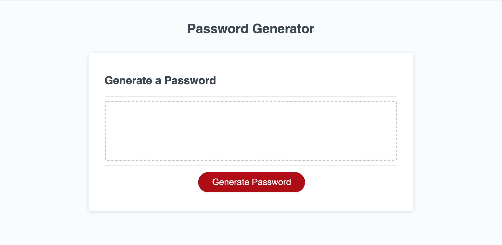
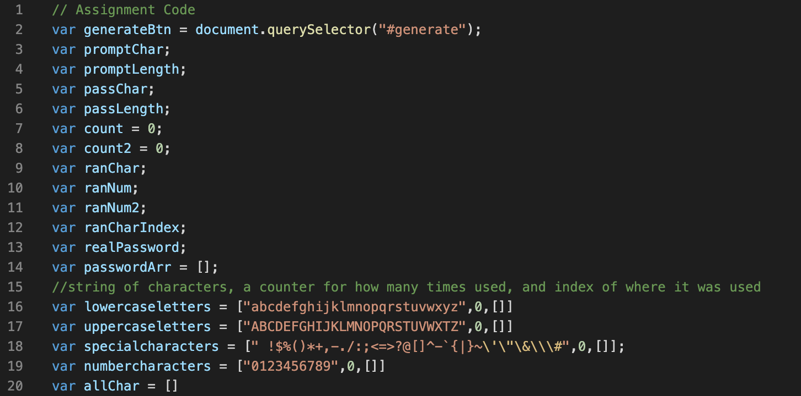

# Password Generator
## Table of contents
* [Prerequisites](https://github.com/brianjunhyuplee/password_generator#prerequisites)
* [Objective](https://github.com/brianjunhyuplee/password_generator#objective)
* [Operation](https://github.com/brianjunhyuplee/password_generator#operation)
* [Process](https://github.com/brianjunhyuplee/password_generator#process)
* [Built-With](https://github.com/brianjunhyuplee/password_generator#built-with)
* [Deployed-Link](https://github.com/brianjunhyuplee/portfolio#deployed-link)
* [Authors](https://github.com/brianjunhyuplee/password_generator#authors)
* [License](https://github.com/brianjunhyuplee/password_generator#license)
* [Acknowledgements](https://github.com/brianjunhyuplee/password_generator#acknowledgments)
## Prerequisites:
* Computer with internet access
## Objective: 

Create a website that generates a random password with the given user criterias.


## Operation:

**To access the website, simply click on this [deploymentlink](https://brianjunhyuplee.github.io/password_generator/).**

1. Start by clicking on the "Generate Password" Button.
2. The interface will prompt the user if a specified length is required.
    1. *If one is not required, click cancel.*
    2. *If one is required, click ok.*
        1. *The user will then be prompted to enter a length between 8 and 128*
        2. *Enter a number between the range*
3. The interface will prompt the user if any specified characters are required.
    1. *If one is not required, click cancel.*
    2. *If one (or more) is required, click ok.*
        1. *The user will then be prompted to enter what characters should be required.*
        2. *Enter the corresponding letters*
4. The interface will do the rest of the work and output results in the text box.


## Process:
**1.  Download given template**

The given template contained three files.
1. *index.html*
2. *style.css*
3. *scripts.js*

After interpreting the HTML and JS files, a basic plan can be made.

*Nothing was added to the HTML and CSS files.*

This is the image of the basic template for the JS file


**2.  Global Variables**

There are many variables that have to be declared globally.
Thought there are many approaches to adding these, this script uses these varibles.


*These variables were declared and written in as neeeded*

**3.  User Inputs**
1. Create a function called generatePassword

A variable called password was defined by a function called generatePassword().
By the name of the function, one can infer that most of the calculations and other functions will be performed here.

*Once this function is completed, the template will print out the password on its own*

*Create the function by using the code below.*
```bash
function generatePassword(){
    ...
}
```


2. Get user inputs for each criteria

Necessary criterias for a password may include length and/or different character types.
Accounting for this, the interface must prompt twice for each criteria.
1. **Confirm**
    
    The user will confirm whether this criteria is necessary for their password.
    *By using confirm(), the interface can "confirm" whether it is needed.*
    ```bash
    var varname = confirm("message");
    ```
2. **Prompt**
    
    If the user confirms, then the user must input correspondingly.
    
    *By using prompt(), the interface will "prompt" any necessary inputs*
    ```bash
    var varname = prompt("message");
    ```


**4. Math**

Using the given information, the script operates to create a randomly generated password.
Most of the code is written in this section.

1. **Length**

Using the length prompted, a for loop is run to construct an array of characters

*If a length was not selected, a random number between 8 and 128 will be selected.*

2. **Characters**
    1. Using the character types prompted, the script will create an array containing all the character types specified.
    
    *If a character type was not selected, one or more will be randomly selected.*
    Each character type consists of 3 elements:
    ```bash
    var charType = ["stringOfAllChars",numberTimesUsed,[emptyarr]];
    ```
    2. Each time the for loop from length is run:
        - add a random character from random character type from the array of character types
        - increment the number of times that character type was used
        - add the index of the for loop to the empty array
    
    3. Check that every character type selected was used at least once.
        - If every character type selected was not used:
            1. Get the indexes of a character type that has been used more than once.
            2. Randomly select one of those indexes and replace it with the character type that needs to be implemented
            3. Increment and decrement the corresponding number of times used
        
3. Randomizer
*Using the below line, a random number between s and e will be generated*
```bash
Math.(floor(Math.random()*e)+s);
```

## Built With:
* [HTML](https://developer.mozilla.org/en-US/docs/Web/HTML)
* [CSS](https://developer.mozilla.org/en-US/docs/Web/CSS)
* [JS]([https://developer.mozilla.org/en-US/docs/Web/JavaScript])

## Deployed Link:
* [Password-Generatpr](https://brianjunhyuplee.github.io/password_generator/)

## Author(s):
**Brian Lee**
* [GitHub](https://github.com/brianjunhyuplee)
* [LinkedIn](https://www.linkedin.com/in/brian-lee-559208187/)
* [MyPortfolio :)](https://brianjunhyuplee.github.io/portfolio/)

## License:

This project is licensed under the [MIT-License](https://www.mit.edu/~amini/LICENSE.md)

## Acknowledgments:
* Jerome Chenette (Lead Instructor of UCB Bootcamp)
* Kerwin Hy (TA at UCB Bootcamp)
* Manuel S Nunes (TA at UCB Bootcamp)
* Roger Le (Instructor at UCB Bootcamp)